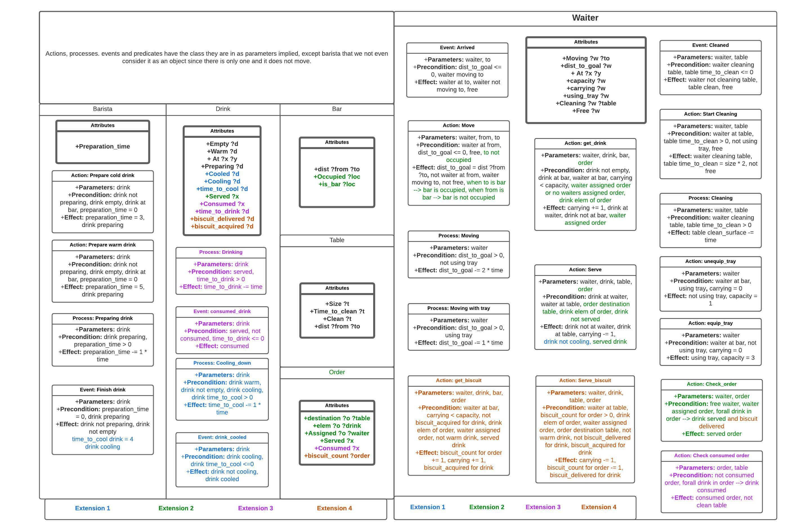

# Robocafe - PDDL+ Task Planning Domain and Problem Set

This is a PDDL+ Task Planning domain and problem set developed for a "Robot-enabled" cafe environment, as part of the course "Artificial Intelligence for Robotics II" at the University of Genoa, Italy. For more details, please refer to the attached report. This is a joint effort by:
- [@amanarora9848](https://github.com/amanarora9848)
- [@davideCaligola](https://github.com/davideCaligola)
- [@Lucas-Pardo](https://github.com/Lucas-Pardo)
- [@pablomoreno555](https://github.com/pablomoreno555)

The design of the domain is best represented by the below image:



## Getting Started

### Prerequisites
The domain is PDDL+ domain and requires a planning engine to be installed. To download the ENHSP Planning Engine, please follow the instructions given on the ENHSP webpage: https://sites.google.com/view/enhsp/

<p>After installing the planning engine: </p>

Clone the repository:
```bash
git clone https://github.com/amanarora9848/robocafe_AI_task_planning.git
```

### Generating Plans:

The script `generate_plan.sh` can be used to generate plans for the given base pddl+ domain and problems with or without using an optimizer, and can also calculate metrics like mean and standard deviation for given data points specific to an optimizer, if used.

For help regarding running the generate_plan.sh script, run the following command:
```bash
$ ./generate_plan.sh -h
```

A typical output after running the script, for, say 30 repititions with planner configuration of <i>opt-hrmax</i> is as follows:
```bash
$ ./generate_plan.sh -p ../enhsp-20.jar -f test.pddl -m 12000 -z -c opt-hrmax -r 30
planner: ../enhsp-20.jar
planner configuration: opt-hrmax
problem: test.pddl
Number of repititions requested: 30
Progress : [########################################] 100.00%
DONE
Metrics written to file: generated_metrics/metrics_test_opt-hrmax.txt
```

The generated plans are stored in the folder `generated_plans` and the metrics are stored in the folder `generated_metrics`.

## Branches:

The repository has six branches, each implementing a specific part of the assignment:

1. <b>main</b>: Contains the base PDDL+ domain and problems.
2. <b>extension1</b>: Contains the PDDL+ domain and problems for extension 1.
3. <b>extension2</b>: Contains the PDDL+ domain and problems for extension 2.
4. <b>extension3</b>: Contains the PDDL+ domain and problems for extension 3.
5. <b>extension4_enhanced</b>: Contains the PDDL+ domain and problems for extension 4.
6. <b>complete</b>: Contains the 'complete' PDDL+ domain integrated with all the extensions and the problems.

To run the script for any of the branches, please checkout to the branch and run the script as mentioned above.